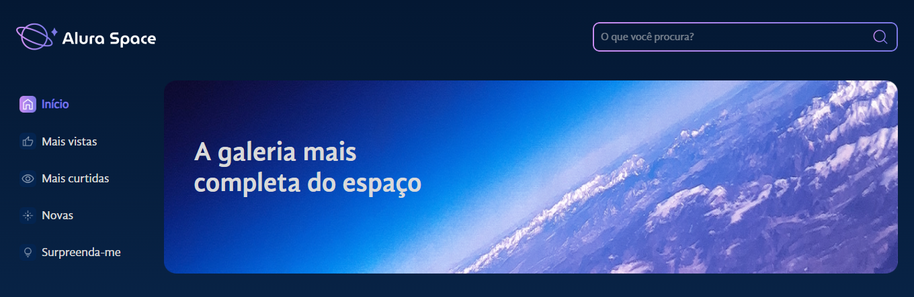
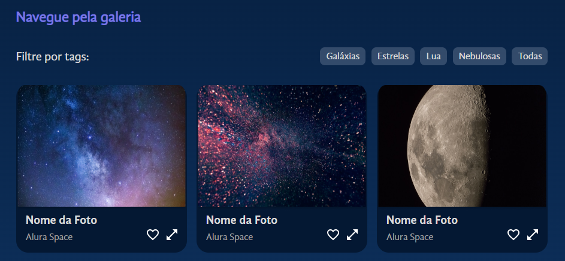

<h1 align="center">Alura Space</h1>

<p align="center">Desenvolvido durante curso da Alura para lidar com arquivos estáticos em React e criar funcionalidades de filtro</p>

<p align="center">
  <a href="#projeto">Projeto</a>&nbsp;&nbsp;&nbsp;|&nbsp;&nbsp;
  <a href="#tecnologias">Tecnologias</a>&nbsp;&nbsp;&nbsp;|&nbsp;&nbsp;
  <a href="#como-iniciar">Como iniciar</a>
</p>




## Projeto

&nbsp;&nbsp;&nbsp;&nbsp;&nbsp;Projeto realizado durante curso da Alura, desenvolvido em React.js para a criação de uma página em que foram criados componentes para melhor organização e reaproveitamento de código, criando filtros de cards para mostrar na tela apenas o tipo de informação desejada, utilizando sass para estilização.

## Tecnologias

Esse projeto foi desenvolvido com as seguintes tecnologias:

- React
- JavaScript
- Sass
- HTML5

## Como iniciar

- Pré-requisitos:

  - Git
  - Node.js
    </br></br>

- Clonar o repositório;
- No diretório raiz, executar:

```
npm install
```

- Após a instalação, instalar a dependência:

```
npm install --save-dev sass
```

- Em seguida, iniciar o projeto:

```
npm start
```
